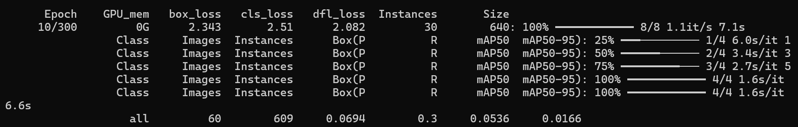
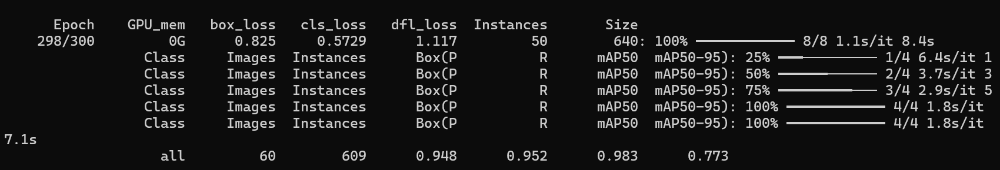
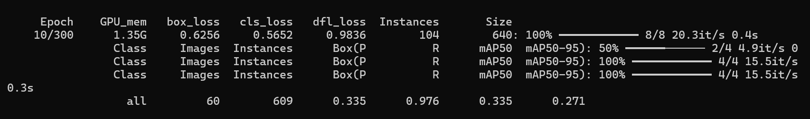
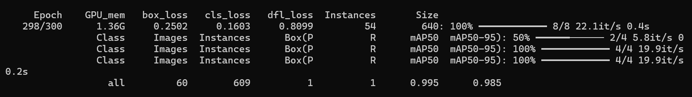

# 🍲 Бууз тоолдог хиймэл оюун

An AI model that detects and counts buuz (Mongolian dumplings) from images using YOLOv8. Optimized for GPU training.
Цагаан сараар бууз тоолно, тоолоод тоогоо алдана гэж айлтгүй боллоо энэ тэр заза наргисан юм. Зүгээр туршиж үзсэн юм.

## Ашигласан модел

### Yolo11s

YOLO (You Only Look Once) бол объект таних нейрон сүлжээний загвар бөгөөд реал таймд дүрс болон видеон дээр объектуудыг хурдан танихад зориулагдсан.

## Хэрэгжүүлэх заавар

- Эхлээд Yolo моделийг татна. Компьютер дээрээ "Ultralytics" сан суулгаж өгөх шаардлагатай. 
- LabelImg ашиглан тухайн сургах гэж буй объектуудыг label хийж өгнө.
- Хэрэв утаснаас зураг татаж ашиглаж буй бол ImageMagick татаад
    magick mogrify -auto-orient *.jpg
  Энэ коммандыг хийж өгөх хэрэгтэй. Ингэснээр зургийн .exif өргөтгөлийг байхгүй болгож өгнө. Учир нь гар утасны зураг зөвхөн .jpg, .jpeg, .png гэхээс гадна .exif гэсэн мэдээлэл агуулдаг өргөтгөл бас байдаг. .exif нь дотроо тухайн зургийг хаана авсан? хэзээ авсан? гэх мэт хэд хэдэн зүйлийн мэдээллийг агуулж байдаг. Мөн цаанаа хэвтээ зураг байлаа гэж бодоход бидэнд дүрслэхдээ босоо гэх юм уу. Зургийг portrait/landscape-ээр авна гэж байдаггүй, зүгээр л бидэнд тэгж харуулдаг гэвэл илүү ойлгомжтой байх.  
- Харин дараа нь CPU/GPU алийг нь ашиглан сургахаа шийднэ. Аль алийг нь хэрэгжүүлэх кодыг доор бичиж өгсөн байгаа.
- Сурсны дараа Count_my_buuz.py-ийг ажиллуулах хэрэгтэй. 

#### Хэрхэн суулгах вэ? 

- Ultralytics суулгах комманд:

"C:\Users\<Өөрийн username>\AppData\Local\Programs\Python\Python312\python.exe" -m pip install "ultralytics>=8.3.0" --no-cache-dir

- pyTorch GPU ашиглах/татах

"C:\Users\<Өөрийн username>\AppData\Local\Programs\Python\Python312\python.exe" -m pip install torch torchvision torchaudio --index-url https://download.pytorch.org/whl/cu121

# CPU

epoch = 10: 

epoch = 298: 

"C:\Users\<Өөрийн username>\AppData\Local\Programs\Python\Python312\python.exe" -m ultralytics predict model=buuz_runs\yolo11s_60photos\weights\best.pt source=test.jpg conf=0.4 save=True

# GPU

### Model (GPU) сургах
yolo train model=yolo11s.pt data="C:\Users\<Өөрийн username>\Desktop\a\hicheel\2025-2026 namar\AI\FinalProject\Data\data.yaml" epochs=300 imgsz=640 batch=8 patience=40 freeze=10 amp=True project=buuz_runs name=yolo11s_gpu_fast exist_ok=True

yolo train model=yolo11s.pt data=data.yaml epochs=300 imgsz=640 batch=8 patience=40 freeze=10 amp=True project=buuz_runs name=yolo11s_gpu_fast exist_ok=True

Epoch = 10:

Epoch = 298: 

## Ажиллуулах
"C:\Users\<Өөрийн username>\AppData\Local\Programs\Python\Python312\python.exe" "C:\Users\<Өөрийн path>\Count_my_buuz.py"